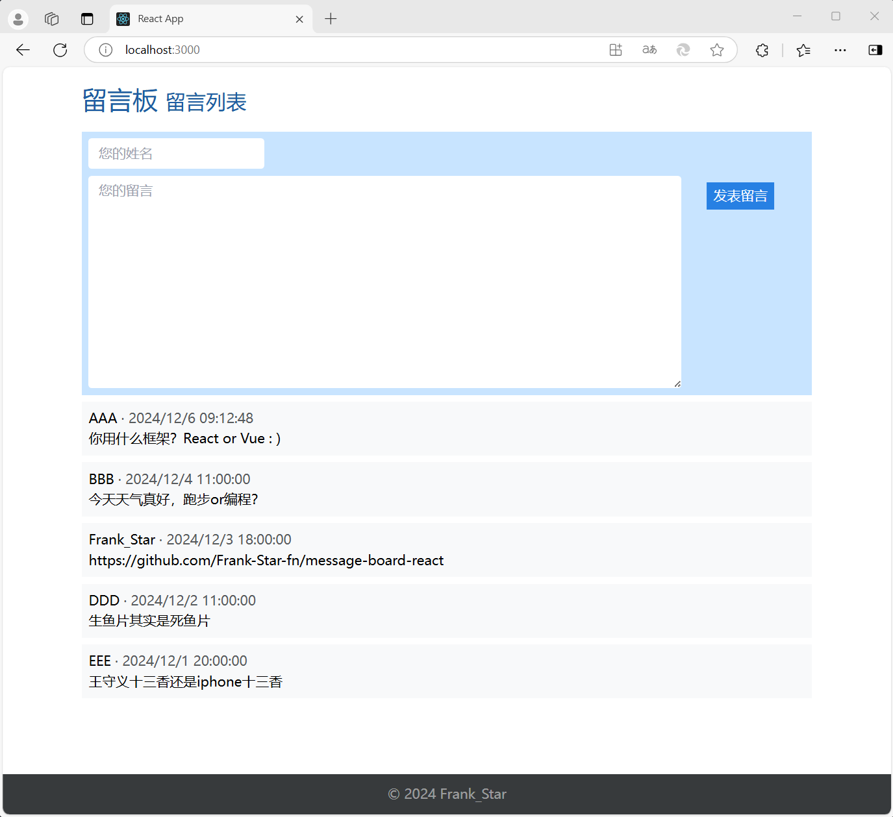

# message-board-react

简易留言板。前端基于react；后端基于node.js和express框架；数据库为mysql。


<!--  -->


## Getting Started

该项目通过 [Create React App](https://github.com/facebook/create-react-app) 启动。

## 启动前端
```
cd your_path_to/my-app
npm start
```

在开发模式下运行应用程序。\
在浏览器中打开 [http://localhost:3000](http://localhost:3000) 查看。

当您进行更改时，页面将重新加载。\
您还可以在控制台中看到任何lint错误。

## 启动Tailwind CLI
```
npx tailwindcss -i ./src/index.css -o ./src/index_output.css --watch
```

## 启动后端
```
cd your_path_to/my-app/server
node server.js
```
后端网址为
[http://localhost:3001](http://localhost:3001)


## 其他可用脚本

### `npm test`
在交互式观察模式下启动测试运行器。\
请参阅[运行测试](https://facebook.github.io/create-react-app/docs/running-tests)以了解更多信息。

### `npm run build`
将用于生产的应用程序构建到`build`文件夹中。\
它正确地将React捆绑在生产模式中，并优化构建以获得最佳性能。构建被缩小，文件名包括哈希值。\
请参阅有关[部署](https://facebook.github.io/create-react-app/docs/deployment)的部分以了解更多信息。


